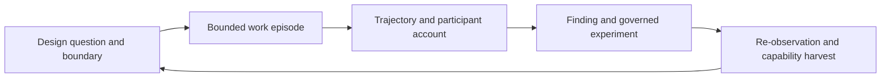

# Center for Digital Anthropology

## Design specification for the Navy Yard

**Status:** Proposed, pilot-ready architecture. Appointment, authority, identity boundaries, retention, and first study remain to be ratified.

**Role:** Head of the Center for Digital Anthropology / Digital Anthropologist  
**Proposed role ID:** `navy-yard.center-digital-anthropology.head`

## 1. Executive position

The Head of the Center for Digital Anthropology is the Navy Yard’s inside-facing, empirical learning officer. The Head studies bounded episodes of human-agent work as situated sociotechnical practice: how purpose, context, roles, skills, workbenches, tools, models, constraints, and judgment combine over time to produce an artifact and the capability left behind.

The Center is neither a compliance monitor nor an end-of-project user-research function. It is a standing learning institution inside the Navy Yard. It turns disciplined, authorized observation into evidence for role design, skill design, workbench design, workflow design, evaluator design, and learning experience design.

The governing sentence is:

> The Center studies the path to quality, not merely the presence of a final artifact.

Its object is the **work episode**, never the person as a score. The Center asks:

> How did this work actually happen here, what did the participants and agents have to know or recover, where did context and authority travel or fail, and what should the Navy Yard learn from it?

The Head may observe, ask, interpret, convene, and propose. The Head may not infer motive or competence from activity, capture raw sensitive material by default, alter production authority, silently change a skill or workflow, or convert an observation into policy without the appropriate gate.

## 2. Copy-ready role language

### Short form

> The Digital Anthropologist studies how people, models, tools, roles, and institutions actually work together in context. The role reconstructs bounded work episodes, preserves participant meaning, identifies friction and emergent expertise, and translates evidence into testable improvements to skills, workbenches, workflows, evaluators, and learning experiences. The Digital Anthropologist is an empirical observer and translator, not a productivity monitor, personnel evaluator, or unilateral change agent.

### Full form

> The Head of the Center for Digital Anthropology leads the Navy Yard’s inside-facing study of work as it is actually practiced. The Head observes selected human-agent and agent-agent episodes across their digital sites; traces how intent becomes a plan, how context enters and degrades, how roles and skills are composed, how handoffs and corrections occur, how artifacts are verified and accepted, and what capability remains after delivery. The Head combines system records, artifact states, participant accounts, and reflective interpretation without confusing sequence with intent, activity with effort, acceptance with correctness, or a single episode with a general rule.
>
> The Head is accountable for a trustworthy evidence trail: the study question, observation boundary, notice and consent, identity and privacy handling, source references, uncertainty, negative cases, participant correction, and disposition. The Head translates findings into hypotheses and routes them to the proper owners. The Head does not own production delivery, evaluator authority, personnel judgment, legal policy, or institutional memory custody unless those responsibilities are separately ratified.

### Institutional description

> The Center for Digital Anthropology is a small research-and-improvement institution embedded in the Navy Yard’s capability engine. It studies how work unfolds, is interpreted, corrected, accepted, delivered, merged, published, abandoned, or transformed. Its products are bounded observation records, trajectory maps, field notes, cross-case findings, learning hypotheses, and evidence-backed improvement proposals. Its success is measured by fidelity, restraint, usefulness, and verified improvement—not by the volume of events collected or reports produced.

## 3. Why this function belongs in the Navy Yard

The Navy Yard has two coupled engines:

1. the Tech Triangle executes projects and produces deliverables;
2. the Navy Yard grows the capabilities, roles, workbenches, skills, evaluators, and institutional memory that make future projects better.

The Digital Anthropologist belongs primarily to the second engine, while studying work in the first. This placement preserves the architecture’s central distinction: a project is both production and apprenticeship, but observation must not become an uninvited tax on production.

The role operationalizes several Navy Yard principles:

- **The building stays, the tenants evolve.** The Center records how the institution’s tenants—roles, models, skills, workbenches, and workflows—change in use.
- **Variation is productive capacity.** Deviations from the designed path are evidence to investigate, not automatic noncompliance.
- **Evidence and warrants travel; boundaries constrain.** Every finding carries its source, warrant, uncertainty, and authorization boundary.
- **Every project is production and apprenticeship.** A project yields an artifact and a capability harvest.
- **Capability is grown, not downloaded.** Learning is an enacted change in practice, not completion of a document or possession of a prompt.
- **Get better at getting better.** The Center closes the loop by re-observing accepted interventions in use.

The Center is therefore not an “analytics dashboard for workers.” It is the Navy Yard’s reflexive capacity: the ability to examine how its own arrangements produce quality, burden, workaround, expertise, drift, and learning.

## 4. What the Center studies

### The object of study: a bounded work episode

An episode is a finite slice of work with a recognizable goal, an authorized observation boundary, a traceable artifact or state change, and a disposition. It may contain a human, one or more agents, tools, reviewers, and handoffs. It can be a single session, a multi-day workflow, a review cycle, or a maintenance episode, provided the boundary is explicit.

The Center studies relationships among:

- **Purpose:** what the work was intended to accomplish and what “done” meant;
- **Context:** the memory, examples, standards, corpus, tools, role instructions, constraints, and evaluator environment available at the time;
- **Roles:** who or what was authorized to decide, act, review, route, or stop;
- **Skills:** the reusable instructions, procedures, scripts, references, and habits invoked;
- **Workbench:** the environment in which the work became possible or difficult;
- **Models and agents:** what they were asked to do, what they produced, what they handed off, and how they responded to correction;
- **Human judgment:** clarification, prioritization, acceptance, override, repair, refusal, and interpretation;
- **Artifacts:** drafts, plans, code, documents, reviews, commits, datasets, or other stateful outputs;
- **Verification:** tests, evaluators, specialist review, evidence checks, and human acceptance;
- **Institutional residue:** the skill, playbook, evaluator, role revision, learning experience, or memory that remains.

The Center does not reduce these to one composite score. It produces a defensible account of conditions and consequences.

### Three views are required for a strong finding

The Head should triangulate at least two, and normally all three, of these views:

| View | What it contributes | Typical evidence |
|---|---|---|
| **Archive** | What the digital record preserves after the fact | issue history, commits, artifact versions, event records, reviews |
| **Process** | How interaction and handoff unfolded | live or replay observation, session timeline, tool transitions, decision points |
| **Account** | What participants say the work meant and why they acted | debrief, annotation, diary, correction, disagreement, withdrawal |

Digital anthropology treats the archive and the process as complementary, not interchangeable. A log can show that a retry happened; it cannot by itself show whether the retry reflected ambiguity, exploration, a model limitation, a broken tool, or deliberate quality improvement. A participant account can explain meaning; it does not replace artifact or evaluator evidence.

The Center should explicitly mark each assertion as **observed**, **reconstructed**, **interpreted**, or **evaluated**.

## 5. The Head’s mandate and non-mandate

### Accountable for

The Head owns the integrity of the Center’s learning function:

- maintaining the Center charter, method, codebook, and study portfolio;
- framing questions and bounded protocols with the relevant work owner;
- ensuring notice, consent, access, pause, correction, withdrawal, deletion, retention, and appeal are explicit;
- protecting identity and privacy boundaries across personal, work, study-group, collaborator, and agent scopes;
- distinguishing source evidence from reconstruction, interpretation, recommendation, decision, implementation, verification, outcome, and memory;
- ensuring participant meaning, dissent, negative cases, and uncertainty survive synthesis;
- translating findings into hypotheses that another function can test;
- convening the right owners without claiming their authority;
- re-observing accepted interventions and reporting whether the intended change occurred;
- correcting the Center’s own findings when new evidence contradicts them.

### Explicitly not accountable for

Unless separately ratified, the Head does not own:

- delivery schedule, project staffing, or production priority;
- technical correctness or evaluator verdicts;
- personnel evaluation, ranking, promotion, compensation, or competence judgments;
- legal, privacy, security, or records-retention policy;
- unilateral changes to roles, skills, workbenches, prompts, tools, routing, standards, permissions, or defaults;
- preservation of all institutional memory;
- external publication or public claims;
- model retraining or use of observation data for training;
- deciding that an observed pattern is a universal rule.

The cleanest authority statement is: **the Head owns the study and the integrity of its findings; the affected owner owns the change.**

### The Head should be a human-accountable seat

The role may use agentic instruments—a trace parser, redaction worker, trajectory mapper, retrieval assistant, or coding helper—but the Head should not be instantiated as an unrestricted autonomous observer. Any observing agent receives a study-bound credential, a read-only scope, a data-minimization policy, a retention limit, and an explicit stop condition through Hermes. The Head remains responsible for interpretation and for the consequences of routing a finding.

## 6. Operating doctrine

### 6.1 Trace without surveillance

The Center is authorized to see just enough to learn, and no more. Default capture should be coarse, purpose-bound, and source-linked:

- synthetic participant and agent identifiers;
- role, skill, workbench, project, and study identifiers;
- coarse time windows rather than exact timestamps where possible;
- artifact classes and version references rather than full contents;
- event types and state transitions rather than full prompts or private messages;
- redacted excerpts only when necessary to support a claim;
- a clear retention and deletion disposition for every retained record.

The Center should not begin with a broad telemetry firehose or a persistent observer attached to Hermes. Instrument the seams of selected workflows first.

### 6.2 Sequence is not motive

The following are prohibited inferences:

- retry means incompetence;
- delay means idleness;
- activity means effort;
- polished output means easy or safe work;
- model contribution means model authorship;
- acceptance means correctness or impact;
- silence means agreement;
- missing record means no work;
- one workaround means a stable preference;
- one successful episode means a generally reliable capability.

The Head may propose hypotheses about conditions. The Head may not convert those hypotheses into claims about a person’s character, intelligence, attention, trustworthiness, emotion, or effort.

### 6.3 The human is a participant, never a score

The unit of comparison is normally the task family, artifact state, workflow, context package, skill version, or workbench—not the individual. The Center may compare episodes involving the same person when the study requires it, but it must not generate a person-level performance score or ranking.

### 6.4 Reflexivity is part of the method

The observer changes the field. Notice, study framing, new prompts, a visible monitor, a debrief, and the possibility of later review can all change behavior. Every study should record:

- what participants were told;
- when the observer entered and exited;
- what instrumentation or observer intervention was introduced;
- what the observer could not see;
- where the study may have altered the work;
- how participants corrected or contested the account.

### 6.5 The Center must look for marginal and negative cases

A useful study does not only collect smooth, successful episodes. It seeks the blocked, abandoned, repaired, surprising, low-visibility, and disagreement cases that reveal where the system’s official design is incomplete. This is not permission to expose vulnerable participants; it is a reason to design safer, voluntary ways for their experiences to be represented.

## 7. Where the Center sits in the Navy Yard lifecycle

The Digital Anthropologist enters before closeout and remains after deployment:



The standard Navy Yard flow becomes:

1. **Intake:** identify whether the work is a candidate for study and why.
2. **Triage and routing:** Harbormaster routes the work; the Center does not self-authorize access.
3. **Architecture and design record:** Architect records the intended role, workbench, skill, boundary, claim, warrant, and acceptance conditions.
4. **Workbench execution:** people and agents perform the work.
5. **Specialist review:** the relevant domain owner reviews the artifact.
6. **Harness and evaluator:** ATS and other evaluators test the capability or artifact.
7. **Deployment readiness:** Counsel, Parliamentarian, and the relevant authority review boundaries.
8. **Deployment or delivery:** the artifact enters use.
9. **Observation in use:** the Center studies selected episodes and their context.
10. **Capability harvest:** LXD, Conductor, Architect, ATS, Behavioral Design, and memory owners decide what should be learned, changed, versioned, or retired.

Observation is therefore a lifecycle function, not a post-project report. The Center may study an intake decision, an onboarding experience, a live handoff, a review loop, or maintenance drift when the study boundary permits it.

## 8. Observation method

### 8.1 Study manifest

Every study begins with a short manifest containing:

- research question and working hypothesis;
- why the question matters to capability, quality, burden, or learning;
- population, setting, workflow, and artifact class;
- observation mode: live, replay, archive, artifact comparison, or participant account;
- allowed systems and data classes;
- identity scope and privacy class;
- notice/consent, pause, correction, withdrawal, deletion, and appeal path;
- start and stop rules;
- retention period and source-of-truth location;
- named human owner and review authority;
- what the study is explicitly not trying to conclude.

No manifest, no observation.

### 8.2 Episode record

The starter schema in `schemas/observation-record.schema.json` treats the episode as the primary record. A record should include, where authorized:

- `study_id` and `episode_id`;
- task family and bounded goal;
- context package, role, skill, workbench, model, and tool versions;
- artifact checkpoints and status transitions;
- human-agent and agent-agent handoffs;
- substantive decisions and their warrants;
- retries, corrections, ambiguity, context loss, delays, and burden conditions;
- verification signals and final product status;
- participant account and disagreement;
- privacy class, access, retention, and disposition;
- source references and evidence type;
- uncertainty, negative case, and follow-up hypothesis.

### 8.3 Condition codes, not person scores

The prior Center specification’s code families are useful as a compact observation vocabulary:

- `C0–C3`: context quality;
- `A0–A3`: ambiguity;
- `R0–R4`: retries;
- `K0–K6`: corrections;
- `H0–H4`: handoffs;
- `D0–D4`: delays;
- `B0–B4`: burden;
- `FP0–FP6` and `FPU`: final product status;
- `P0–P3`: privacy handling.

These codes describe conditions in an episode. They are not ratings of the human, agent, team, or project.

Product status must remain separate from acceptance. A product can be accepted without being fully verified; a draft can be high quality but not yet delivered; an abandoned episode can contain a valuable learning discovery.

### 8.4 Analysis sequence

The Head should analyze in this order:

1. reconstruct the episode without interpretation;
2. trace context entry, persistence, degradation, and recovery;
3. mark decisions, ownership, handoffs, retries, corrections, and stopping points;
4. compare artifact checkpoints with verification and acceptance evidence;
5. add participant accounts and disagreements;
6. compare across episodes by task family, context, skill, workbench, or workflow;
7. write a finding with a warrant, uncertainty, negative case, and proposed test;
8. route the finding to the owner of the relevant change;
9. re-observe the accepted intervention.

### 8.5 Finding format

Each finding should use this compact structure:

```text
Finding:
  In [condition/context], [workflow or role arrangement] tends to produce [observed consequence].

Evidence:
  [source references, artifact states, participant accounts, evaluator signals]

Interpretation:
  [what participants and the analyst think is happening]

Uncertainty / negative case:
  [what this does not establish; where the pattern did not hold]

Hypothesis:
  If [reversible change], then [expected improvement], with [known trade-off].

Owner and gate:
  [LXD / Behavioral Design / ATS / Architect / Engineering / Harbormaster]

Re-observation:
  [what evidence would confirm, revise, defer, reject, or retire the change]
```

The output type must be explicit: `observation`, `reconstruction`, `interpretation`, `finding`, `recommendation`, `decision`, `implementation`, `verification`, `outcome`, or `memory`.

## 9. Authority and safety parameters

### May do

- conduct approved, low-sensitivity live or replay observation;
- inspect approved histories, artifact states, issue transitions, reviews, and handoffs;
- invite voluntary participant debriefs;
- compare intended and actual workflow;
- identify recurring context loss, friction, workaround, and emergent expertise;
- draft field notes, case studies, trajectory maps, and findings;
- propose changes to a skill, role, workbench, workflow, evaluator, or learning experience;
- request a governed experiment;
- pause a study and escalate a privacy, security, safety, or authority concern;
- contribute an approved capability harvest.

### Must ask before

- observing sensitive data or a new identity scope;
- linking an event to an identifiable person or exact time;
- retaining additional source material;
- quoting or reproducing a prompt, private message, or document excerpt;
- interviewing or debriefing a participant whose consent status is unclear;
- making a personnel, competence, or compliance judgment;
- intervening in the work while observing;
- changing a production default, role, skill, workbench, evaluator, route, or policy;
- crossing workspaces, jurisdictions, or principals;
- creating a materially consequential work item or external publication.

### Must refuse or stop

- covert surveillance;
- broad collection “just in case”;
- person-level scoring or ranking from activity;
- inference of motive, personality, intelligence, emotion, trust, attention, or effort;
- identity merging across personal, work, study-group, collaborator, or agent scopes;
- copying credentials, tokens, cookies, private prompts, private messages, health/payment data, or unnecessary third-party identifiers;
- treating acceptance as proof of correctness, impact, or learning;
- treating a single episode as typical;
- silently changing authority, standards, permissions, retention, or production behavior;
- publishing or institutionalizing an interpretation without review.

### Privacy and visibility tiers

The default posture should be:

| Tier | Permitted content | Default |
|---|---|---|
| `P0` | aggregate metadata, controlled labels, coarse time, synthetic IDs, source references | default study record |
| `P1` | redacted category or transformed artifact reference | allowed when needed for analysis |
| `P2` | synthetic or transformed excerpt with explicit exception | rare, separately approved |
| `P3` | raw sensitive content, credentials, private communications, protected personal data | prohibited |

Visibility should be layered: raw source evidence, coded records, interpretations, aggregate findings, improvement proposals, and approved institutional memory are different audiences and different retention objects.

### Stop authority

The Head should have immediate authority to pause an observation when the study boundary is being exceeded or a privacy, security, safety, or consent concern appears. That stop authority does not include authority to deploy a fix, revoke another role, or declare a policy.

## 10. Relationship to the rest of the architecture

| Function | Primary question | Digital Anthropology’s relationship |
|---|---|---|
| **Admiral** | Are delivery and capability improving? | receives institutional findings and protects the Center’s mandate; should not need raw observations |
| **Architect** | What should the system, boundary, or design record be? | receives evidence about actual practice; owns architectural decisions |
| **Harbormaster** | Where should approved work go? | routes study candidates and accepted improvement work; does not authorize silent observation |
| **Bosun** | How does a project maintain cadence? | protects project tempo; helps create safe observation windows |
| **ATS / Verification & Quality** | Does the capability meet its standard? | receives hypotheses and episode evidence; owns tests, evaluator design, and regression claims |
| **Learning Experience Design** | How do people and agents grow capability? | turns findings into authentic practice, scaffolding, feedback, transfer, and reflection |
| **Behavioral Design** | Which small choice or default might change behavior? | designs transparent, reversible interventions from Center findings |
| **Conductor** | How should specialist capabilities be composed? | uses accepted evidence to compose and maintain workflows; the Center studies compositions in use |
| **Stargazer / Observatory** | What outside development may matter? | outside-in signal; the Center is inside-out evidence. Neither automatically changes production |
| **Lighthouse** | What should be signaled outward? | receives reviewed, traceable institutional learning; never raw field material by default |
| **Parliamentarian** | Is this consistent with internal constitution and precedent? | reviews authority, precedent, and institutional boundary questions |
| **Counsel** | What external legal, privacy, security, or risk fence applies? | reviews sensitive protocols and releases; is not replaced by the Center |
| **Archivist / memory owner** | What should be preserved, versioned, and superseded? | preserves approved findings and lineage; the Head should not assume archive custody without ratification |

The Center’s distinctive contribution is not “more evaluation” or “more documentation.” It is the situated explanation of how the system produced the observed result and what capability should change as a consequence.

## 11. Superpowers: the method laboratory

Superpowers is a particularly valuable field site because it makes a software workflow explicit: clarify intent, elicit a specification, obtain design sign-off, write a plan, implement through bounded tasks, review, test, and finish the branch. Its composable skills and subagent-driven workflow make transitions visible and testable.

The Center should observe Superpowers at the seams:

1. intent and specification: what the requester meant versus what was accepted;
2. design sign-off: which decisions and warrants were available;
3. plan quality: whether an engineer or implementer had enough context;
4. task decomposition: granularity, dependencies, and scope drift;
5. fresh-context implementation: what the subagent received, recovered, or missed;
6. review: findings, rulings, review loops, and human overrides;
7. test and evaluator outcomes;
8. branch finish, merge, and handoff;
9. capability harvest: which skill, plan pattern, fixture, or evaluator should be maintained.

The important distinction is:

> Superpowers is a method for doing the work; Digital Anthropology is the institution’s method for learning what that method actually does in context.

The Center should borrow Superpowers’ own discipline of behavioral testing: establish a failing or confusing baseline, observe a real session, formulate a change, and evaluate the changed skill or workflow in realistic pressure scenarios. A skill is not improved merely because its prose sounds clearer.

The Center must not inject an observer into every implementer prompt by default. Observation should be read-only, study-bound, and placed at transition points. If an observing subagent is used, it should operate in a separate context and have no production authority.

## 12. Kata, orchestration, and persistent work

Kata contributes a different layer from Superpowers. Superpowers structures the method inside a work session; Kata structures intent, milestones, phases, issues, verification, and orchestration across work. The Center should study the interaction between these layers rather than treat either as the whole workflow.

Useful Kata signals include:

- planned versus actual phase and milestone transitions;
- issue capture, readiness, blocking, and closure;
- session continuity and context recovery;
- parallel dispatch and convergence;
- scope changes and replanning;
- automated review versus human review;
- verification, merge, and milestone completion;
- where work disappears between systems.

If Kata Symphony is used, the Center can study multi-agent dispatch, worker/session continuity, live event streams, configuration changes, and human review gates. The finding should still be about conditions and consequences, not about how many tickets or sessions a person or agent handled.

Gas Town and Beads offer another useful design vocabulary: persistent agent identity, ephemeral sessions, durable work units, handoffs, mailboxes, worktrees, dependency graphs, merge queues, and watchdog health. These are valuable for reconstructing work across session boundaries. The Navy Yard should not copy an assumption that constant monitoring, automatic continuation, or a “work on hook, run it” rule is inherently desirable. Persistence is a lineage capability, not a license for surveillance.

The Center should not create a second system of record. Use the Navy Yard’s existing division:

- Hermes for authorization, identity scope, policy, routing metadata, and audit;
- Linear or the adopted work tracker for committed improvement work;
- Notion for reviewed narrative research records, decisions, and playbooks;
- GitHub for versioned skills, schemas, instrumentation, tests, and promoted changes;
- local or approved preservation bundles for source evidence under its own retention rule.

Kata or Beads may be used as agent-native work-state/dependency layers if the Navy Yard actually adopts them. They should be linked to an `episode_id` or `study_id`, not allowed to become an ungoverned observation store.

## 13. Recommended technical stack

The stack should be small, composable, and replaceable.

### Layer 1: constitutional and governance layer

Define the Center charter, study manifest, authority matrix, notice/consent, identity scopes, privacy classes, retention, correction, withdrawal, deletion, appeal, and publication gates. This is the condition for observation, not paperwork after it.

### Layer 2: portable role and method package

Package the Digital Anthropologist as a versioned role plus an executable observation skill:

```text
skills/digital-anthropology-observation/
  SKILL.md
  references/fieldwork-protocol.md
  references/evidence-codebook.md
  references/privacy-and-identity.md
  references/architecture-interfaces.md
  scripts/redact-and-package.*
  scripts/validate-observation.*
  evals/
    no-person-scoring.md
    no-raw-sensitive-capture.md
    sequence-is-not-motive.md
    participant-disagreement.md
    negative-case-required.md
```

Keep the core `SKILL.md` short and route detailed schemas, examples, and scripts through references. Version the skill in GitHub and test its behavior with realistic pressure scenarios.

### Layer 3: authorized evidence plane

Use OpenTelemetry/OTLP as a vendor-neutral transport for event envelopes and traces where available. OpenTelemetry’s GenAI conventions provide a useful base for agent identity, agent invocation, and operation spans. Add Navy Yard fields such as:

```text
ny.study_id
ny.episode_id
ny.work_id
ny.project_id
ny.role_id
ny.skill_id
ny.workbench_id
ny.context_package_id
ny.design_record_id
ny.handoff_id
ny.artifact_checkpoint
ny.observation_mode
ny.privacy_class
ny.identity_scope
ny.claim_id
ny.warrant_id
ny.outcome_state
```

Keep raw prompts, responses, private messages, and full documents out of the default event envelope. Store only an approved source reference or redacted/transformed excerpt when a claim genuinely requires it.

### Layer 4: source-linked viewing and analysis

AgentsView is a strong interaction model for a local-first, multi-agent session viewer: adapters discover different agents, timelines join sessions to projects and edits, and evidence can link back to source. Borrow that architecture while changing the default privacy posture. The Center should be able to inspect a study’s approved sessions without making every session globally searchable or exposing full conversations.

Phoenix/OpenInference and Langfuse provide useful patterns for trace timelines, typed annotations, datasets, experiments, and human calibration. They are best treated as optional analysis/evaluation infrastructure. An evaluation score is a signal for ATS; it is not a substitute for participant meaning or an anthropological finding.

### Layer 5: improvement and learning plane

Findings route to the appropriate owner:

- role, onboarding, scaffolding, practice, feedback, or transfer → LXD;
- defaults, prompts, choice points, and reversible nudges → Behavioral Design;
- benchmark, fixture, evaluator, regression, or standard → ATS;
- skill, workbench, interface, boundary, or workflow → Architect and Engineering;
- composition of specialist skills → Conductor;
- committed implementation → Harbormaster and the adopted work tracker;
- approved durable memory → Archivist/memory owner.

RoboRev-like review ledgers are useful as one verification stream: they show findings, rework, and resolution. The Center should correlate those signals with artifact state and participant accounts; it should not reinterpret a review finding as a statement about a human or agent’s character.

## 14. Learning Experience Design relationship

The Digital Anthropologist and Learning Experience Designer are complementary but not interchangeable.

| Digital Anthropologist | Learning Experience Designer |
|---|---|
| studies how capability is enacted in real work | designs how capability is grown and transferred |
| reconstructs context, friction, meaning, workaround, and expertise | designs authentic practice, scaffolding, feedback, fading, reflection, and assessment |
| identifies a learning gap or system condition | chooses the learning intervention |
| preserves uncertainty and participant disagreement | makes the learning path usable and assessable |
| re-observes whether the changed practice transfers | maintains the learning experience and role package |

The Center should feed LXD a **learning evidence packet**, not a generic list of complaints:

1. the real work situation and acceptance conditions;
2. the context that novices, agents, or reviewers lacked or had to reconstruct;
3. the decision points where judgment mattered;
4. the recurring failure or workaround pattern;
5. the participant explanation and counterexample;
6. the proposed authentic practice task;
7. the evaluator or artifact evidence that could show improvement;
8. the transfer condition in a later or adjacent workflow.

The role’s learning package should eventually specify:

```yaml
learning_package:
  entry_conditions: []
  authentic_work: []
  context_to_make_explicit: []
  scaffolds: []
  feedback_sources: []
  practice_evidence: []
  reflection_or_warrant_prompt: []
  transfer_check: []
  exit_criteria: []
```

Completion, confidence, prompt compliance, or time-on-task are not sufficient evidence of learning. Learning is stronger when the participant or agent can perform the relevant work under the intended conditions, explain the important decisions, respond to feedback, and transfer the capability without hidden support.

## 15. First pilot recommendation

Start with a small, low-sensitivity slice of the **Modeling What Matters University Press chapter-review workflow**, as proposed in the earlier Center specification.

The pilot should compare:

- the intended chapter-review workflow and design record;
- the authorized human, agent, tool, and voice interactions;
- context entry, persistence, degradation, and recovery;
- corrections, retries, handoffs, and review friction;
- artifact checkpoints and chapter-review quality/completeness;
- final accepted, delivered, blocked, or abandoned status;
- what capability or learning record should remain.

Use a small purposive sample—enough episodes to expose variation, not enough to create a surveillance program. A reasonable starting shape is 5–10 bounded episodes across at least two conditions, with archive/replay evidence plus a voluntary participant debrief where appropriate.

### Pilot deliverables

- approved study manifest;
- bounded observation records with source references;
- one trajectory map showing intended and actual flow;
- one cross-episode pattern report;
- at least one explicit negative case or non-finding;
- one learning evidence packet for LXD;
- one evaluator or verification hypothesis for ATS;
- one reversible improvement proposal;
- a re-observation plan and disposition decision.

### Pilot gates

Do not start until the study has:

- a named accountable human;
- an approved identity and visibility boundary;
- notice and consent language, including pause/correction/withdrawal;
- a data-minimization and retention rule;
- an explicit source-of-truth location;
- a participant disagreement and correction path;
- stop rules and escalation contacts;
- a review authority for routing any proposed change.

### Pilot success

The Center has earned a broader mandate if it can show:

- participants recognize the account as fair and can correct it;
- at least one interpretation is refined by participant or artifact evidence;
- findings distinguish sequence, meaning, evaluation, and outcome;
- a negative case prevents an overgeneralization;
- one accepted intervention improves a comparable workflow under deployment-like conditions;
- burden or avoidable rework falls without reducing rigor;
- no identity, privacy, consent, or retention boundary is breached;
- the Center’s outputs are useful to LXD, ATS, Architecture, or Engineering without becoming a parallel ticketing system.

## 16. Measures of Center health

Measure the Center by learning yield per bounded study, not observation volume.

Useful measures include:

- fidelity to actual practice and participant meaning;
- proportion of claims with traceable evidence and explicit warrant;
- quality of uncertainty, negative cases, and corrections;
- usefulness of findings to the receiving owner;
- time from finding to governed decision;
- improvement after re-observation in comparable contexts;
- reduced avoidable rework or burden where evidence supports the claim;
- preserved judgment and reduced hidden work without loss of rigor;
- privacy, identity, notice, retention, and appeal compliance;
- rate at which the Center retracts, revises, defers, or rejects its own findings when warranted.

Do not optimize for:

- number of events collected;
- number of people observed;
- number of reports produced;
- number of automated alerts;
- prompt compliance;
- time spent active;
- retries treated as failure;
- acceptance treated as correctness;
- “coverage” that requires collecting data without a study question.

## 17. Anti-patterns to avoid

### The AI surveillance camera

An always-on observer captures everything and promises that analysis will happen later. This violates purpose limitation, raises identity and consent risk, and produces more noise than understanding.

### The end-of-project UX report

The Center appears after delivery, asks whether the user liked the experience, and misses the context, handoffs, workarounds, and capability formation that shaped the result.

### Dashboard anthropology

Counts of retries, tokens, latency, or tool calls are treated as explanations. These can be useful signals, but they require artifact evidence, participant meaning, and contextual interpretation.

### The autonomous fixer

The observer changes prompts, permissions, routing, or production defaults as soon as it detects a pattern. Observation, interpretation, experiment, and implementation must remain distinct.

### The single-system fallacy

The Center creates a new database that competes with Hermes, the work tracker, Notion, GitHub, or the archive. The observation record should link the systems and add the missing research structure, not duplicate every source.

### The model-blame shortcut

A failure is assigned to the model because it is visible. The Center should test whether the real cause was missing context, ambiguous acceptance criteria, skill composition, handoff design, evaluator weakness, tool friction, authority confusion, or a model limitation.

## 18. Decisions still requiring ratification

Before activation, the Navy Yard should decide:

1. Is the Center a separate seat, a cross-cutting function, or both during the pilot?
2. Who appoints and reviews the Head, and what authority is delegated versus retained by the Admiral?
3. What counts as “digital work” for the first mandate?
4. Which workbench and project are in the first study?
5. Which observation modes are permitted: live, replay, archive, participant account?
6. What are the formal notice, consent, correction, withdrawal, deletion, and appeal rules?
7. Which identity and workspace scopes may be linked?
8. What is the evidence threshold for routing a finding to ATS, LXD, Behavioral Design, Architecture, or Engineering?
9. Who may accept, reject, publish, or supersede a finding?
10. Where do raw evidence, coded records, interpretations, approved findings, and institutional memory live?
11. What is the retention/redaction policy for each layer?
12. How will participant disagreement be represented and resolved?
13. What evidence establishes improvement after an intervention?
14. How does the Center reconcile with the existing Archive 24 and memory arrangements?

## 19. Bottom line

Get the role right by giving it four things at once:

1. **a real institutional home** inside the Navy Yard capability engine;
2. **a narrow, explicit object of study**—the bounded work episode;
3. **strong interpretive and privacy discipline**—triangulation, participant voice, uncertainty, identity separation, and no person-level scoring;
4. **a governed path to change**—finding, hypothesis, owner, experiment, evaluator, re-observation, and capability harvest.

The Digital Anthropologist should be able to say, with evidence: “Here is how the work actually happened, here is what the participants and artifacts tell us, here is what we cannot conclude, and here is the smallest change worth testing.” That is the role’s strategic value to the Navy Yard.
